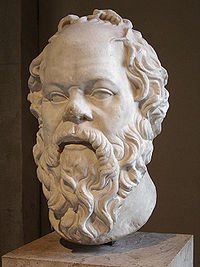
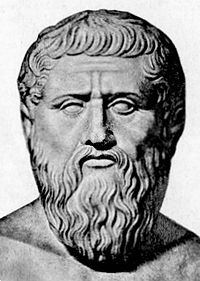
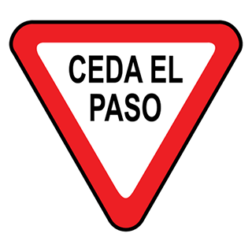
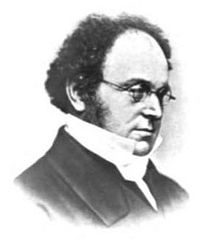

---
# Copyright (c) 2026 Angela Villota, and collaborators from the CyED block
# Licensed under the PolyForm Noncommercial License 1.0.0.
# Commercial use is prohibited without prior written authorization.
title: "Unidad preliminar: Lógica proposicional"
---

# Unidad preliminar: Lógica proposicional

La lógica proposicional tiene sus raíces en la filosofía griega clásica. Los
silogismos de Aristóteles —como el célebre *"todos los hombres son
mortales, Sócrates es hombre, por lo tanto, Sócrates es mortal"*— son un
antecedente directo del razonamiento formal que hoy se representa con
símbolos y tablas de verdad.

|  |  |  |
|---|---|---|
|  |  |  |
| Sócrates (470 a.C.) | Platón (424 a.C.) | Aristóteles (384 a.C.) |

La lógica formal moderna se divide en dos grandes bloques que se estudian en
este curso: la **lógica proposicional** (esta unidad) y la **lógica de
predicados** (unidad a incorporar más adelante).

## Concepto de proposición

**Proposición.** Es una oración declarativa que es verdadera o falsa, pero
no ambas a la vez.

**Ejemplos:**

- Bogotá es la capital de Colombia
- Lima es la capital de Perú
- $2+3=6$
- $5-1=4$
- 4 es un número primo

Considere las siguientes afirmaciones. En cada caso, pregúntese si son
oraciones declarativas y si se les puede asignar un único valor de verdad.


- "EN ESTE SALÓN HAY MÁS DERECHOS QUE ZURDOS"
- "EN ESTE SALÓN HAY MÁS HOMBRES QUE MUJERES"
- "EN ESTE SALÓN NADIE HABLA FRANCÉS"
- "EN ESTE SALÓN NADIE TIENE MOTO"
- "EN ESTE SALÓN NADIE TIENE UN TATUAJE"

Todas son proposiciones: son afirmaciones declarativas que, para un salón
concreto, resultan verdaderas o falsas (aunque no sepamos cuál sin contar).

**No es una proposición** aquella expresión que no es declarativa o que no
se puede decir si es falsa o verdadera.

**Ejemplos de expresiones que no son proposiciones:**

|  |  |
|---|---|
| "NO FUMAR" | "CEDA EL PASO" |

- "NO FUMAR" y "CEDA EL PASO": son órdenes/instrucciones, no oraciones
  declarativas.


- "ESTUDIEN MUCHO DISCRETAS": también es una orden, no una oración
  declarativa.
- "VAN A PERDER DISCRETAS": no se sabe si es verdadero o falso en el momento
  de enunciarla.


- "LOS OVNIS EXISTEN": tampoco se puede establecer su valor de verdad de
  forma inequívoca.

**Ejemplo para discusión:** ¿qué proposición representaría el siguiente
aviso?


**Indique cuáles de las siguientes expresiones son proposiciones:**

- 11 es un número primo
- Andrés vivirá 60 años
- Cali no va a ganar el torneo
- Camila tiene un promedio de 4.5

Note que aunque no siempre se conozca el valor de verdad de antemano (como
en "Andrés vivirá 60 años"), lo importante es que la expresión sea
declarativa y que **en principio** tenga un único valor de verdad.

**Estas son algunas proposiciones:**

- 11 es un número primo
- Camila tiene un promedio de 4.5
- Bogotá es la capital de Colombia
- Lima es la capital de Perú
- $2+3=6$
- $5-1=4$

### Símbolos proposicionales

Para denotar las proposiciones se usan letras, llamadas **símbolos
proposicionales**, y se expresan de la siguiente forma:

- $p$: "11 es un número primo"
- $q$: "Camila tiene un promedio de 4.5"
- $r$: "Bogotá es la capital de Colombia"
- $s$: "Lima es la capital de Perú"
- $t$: "$2+3=6$"
- $u$: "$5-1=4$"

El **valor de verdad** de una proposición indica si es verdadera (V) o
falsa (F). Por ejemplo:

- El valor de verdad de $p$ es V (verdadero)
- El valor de verdad de $t$ es F (falso)

**¿Cuál es el valor de verdad de $r$, $s$ y $u$?**

:::{dropdown} Respuesta
- $r$: V (Bogotá sí es la capital de Colombia)
- $s$: V (Lima sí es la capital de Perú)
- $u$: V ($5-1=4$)
:::

## Proposiciones simples y compuestas

Se pueden relacionar diferentes proposiciones simples para formar una
proposición **compuesta**:

- Hoy es martes y la temperatura es de 21º C
- Si no llueve hoy entonces voy a la clase de discretas
- No es cierto que Juan perdió el examen
- Cali perdió contra el Junior y no clasificó a la final
- Javier perdió Discretas o Cálculo

Las proposiciones se pueden relacionar por medio de **conectivos lógicos**
u **operadores**.

### Operadores lógicos

- Negación ($\neg$)
- Conjunción ($\wedge$)
- Disyunción ($\vee$)
- O-exclusivo ($\oplus$)
- Implicación ($\to$)
- Doble implicación ($\leftrightarrow$)

**Represente las siguientes proposiciones compuestas usando los conectivos
lógicos, y determine el valor de verdad de las dos primeras:**

1. Hoy es martes y la temperatura es de 21º C
2. Si no llueve hoy entonces voy a la clase de discretas
3. No es cierto que Juan perdió el examen
4. Cali perdió contra el Junior y no clasificó a la final
5. Javier perdió Discretas o Cálculo

## Negación ($\neg$)

| Proposición | Negación |
|---|---|
| $p$: "Bogotá es la capital de Colombia" | $\neg p$: "Bogotá no es la capital de Colombia" |
| $p$: "El idioma oficial en Colombia es el inglés" | $\neg p$: "El idioma oficial en Colombia no es el inglés" |

**Tabla de verdad**

| $p$ | $\neg p$ |
|---|---|
| V | F |
| F | V |

## Conjunción ($\wedge$)

- En este salón hay más hombres que mujeres y las mujeres tienen un mejor
  promedio de calificaciones que los hombres
- Este semestre perdí Discretas y Cálculo

| $p$ | $q$ | $p \wedge q$ |
|---|---|---|
| "Bogotá es la capital de Colombia" | "$1+1=2$" | "Bogotá es la capital de Colombia" y "$1+1=2$" |
| "$1+1=2$" | "El idioma oficial en Colombia es el inglés" | "$1+1=2$" y "El idioma oficial en Colombia es el inglés" |
| "El idioma oficial en Colombia es el inglés" | "$1+1=2$" | "El idioma oficial en Colombia es el inglés" y "$1+1=2$" |
| "El idioma oficial en Colombia es el inglés" | "$1+1=7$" | "El idioma oficial en Colombia es el inglés" y "$1+1=7$" |

**Tabla de verdad**

| $p$ | $q$ | $p \wedge q$ |
|---|---|---|
| V | V | V |
| V | F | F |
| F | V | F |
| F | F | F |

**Realice la prueba de escritorio** para el siguiente algoritmo, para los
valores de la tabla:

```
Inicio
   a, b → entero
   c → entero
   preguntar(a)
   preguntar(b)
   si (a>1 y b<15)
       c = 2*a + 3*b
       mostrar(c)
   sino
       c = 4*a + 2
       mostrar(c)
Fin
```

| $a$ | $b$ | $c$ |
|---|---|---|
| 2 | 10 | ? |
| 0 | 40 | ? |
| 5 | 20 | ? |

:::{dropdown} Respuesta
| $a$ | $b$ | $c$ |
|---|---|---|
| 2 | 10 | 34 |
| 0 | 40 | 2 |
| 5 | 20 | 22 |
:::

**Muestre la tabla de la conjunción cuando se tienen 3 proposiciones**

| $p$ | $q$ | $r$ | $p \wedge q \wedge r$ |
|---|---|---|---|
| V | V | V | V |
| V | V | F | F |
| V | F | V | F |
| V | F | F | F |
| F | V | V | F |
| F | V | F | F |
| F | F | V | F |
| F | F | F | F |

## Disyunción ($\vee$)

- Voy al cine o me quedo en casa

| $p$ | $q$ | $p \vee q$ |
|---|---|---|
| "Bogotá es la capital de Colombia" | "$1+1=2$" | "Bogotá es la capital de Colombia" o "$1+1=2$" |
| "$1+1=2$" | "El idioma oficial en Colombia es el inglés" | "$1+1=2$" o "El idioma oficial en Colombia es el inglés" |
| "El idioma oficial en Colombia es el inglés" | "$1+1=2$" | "El idioma oficial en Colombia es el inglés" o "$1+1=2$" |
| "El idioma oficial en Colombia es el inglés" | "$1+1=7$" | "El idioma oficial en Colombia es el inglés" o "$1+1=7$" |

**Tabla de verdad**

| $p$ | $q$ | $p \vee q$ |
|---|---|---|
| V | V | V |
| V | F | V |
| F | V | V |
| F | F | F |

**Realice la prueba de escritorio** para el siguiente algoritmo, para los
valores de la tabla:

```
Inicio
   a, b → entero
   c → entero
   preguntar(a)
   preguntar(b)
   si (a>10 ó b<5)
       c = 2*a + 4*b
       mostrar(c)
   sino
       c = 3*a – 1*b
       mostrar(c)
Fin
```

| $a$ | $b$ | $c$ |
|---|---|---|
| 15 | 7 | ? |
| 8 | 10 | ? |
| 1 | 2 | ? |

:::{dropdown} Respuesta
| $a$ | $b$ | $c$ |
|---|---|---|
| 15 | 7 | 58 |
| 8 | 10 | 14 |
| 1 | 2 | 10 |
:::

## O-exclusivo ($\oplus$)

- Hamlet fue escrito o en 1601 o en 1688
- Sarah quiere o a Oscar o a Juan
- En su plato de entrada puede escoger o sopa o ensalada
- En su bandeja puede escoger o carne o pollo

**Complete la tabla para** "En su plato de entrada puede escoger o sopa o
ensalada"

| $p$ | $q$ | $p \oplus q$ |
|---|---|---|
| V | V | ? |
| V | F | ? |
| F | V | ? |
| F | F | ? |

:::{dropdown} Respuesta
| $p$ | $q$ | $p \oplus q$ |
|---|---|---|
| V | V | F |
| V | F | V |
| F | V | V |
| F | F | F |
:::

## Implicación ($\to$)

- Si pierdo los seguimientos entonces pierdo discretas
- Si me queda discretas en 2.9 entonces el profesor no me pasa
- Si soy elegido, bajaré los impuestos

**Complete la tabla para** "Si soy elegido, bajaré los impuestos"

| $p$ | $q$ | $p \to q$ |
|---|---|---|
| V | V | ? |
| V | F | ? |
| F | V | ? |
| F | F | ? |

:::{dropdown} Respuesta
| $p$ | $q$ | $p \to q$ |
|---|---|---|
| V | V | V |
| V | F | F |
| F | V | V |
| F | F | V |
:::

Solo se incumple el condicional si el candidato **es elegido** y **no baja
los impuestos**. En cualquier otro caso, el condicional no se rompe (aunque
el candidato no salga elegido, no dijo qué pasaría en ese caso).

Otro ejemplo: "Si hace sol, entonces iremos a la playa" también sigue esta
misma tabla de verdad.

## Doble implicación ($\leftrightarrow$)

- Paso el curso si, y solo si, gano el examen
- Puede tomar el postre si, y solo si, acabas tu comida

Sea $p$: "paso el curso", $q$: "gano el examen".

**Complete la tabla para** "Paso el curso si, y solo si, gano el examen"

| $p$ | $q$ | $p \leftrightarrow q$ |
|---|---|---|
| V | V | ? |
| V | F | ? |
| F | V | ? |
| F | F | ? |

:::{dropdown} Respuesta
| $p$ | $q$ | $p \leftrightarrow q$ |
|---|---|---|
| V | V | V |
| V | F | F |
| F | V | F |
| F | F | V |
:::

## Resumen de conectivos

| Conectivo | Significado | Proposición compuesta | Nombre en lógica |
|---|---|---|---|
| $\wedge$ | Y | $p \wedge q$ | Conjunción |
| $\vee$ | O | $p \vee q$ | Disyunción |
| $\neg$ | No | $\neg p$ | Negación |
| $\to$ | si .. entonces | $p \to q$ | Condicional |
| $\leftrightarrow$ | si y solo si | $p \leftrightarrow q$ | Bicondicional |

**Tablas de verdad de referencia**

| $p$ | $q$ | $\neg p$ | $p \wedge q$ | $p \vee q$ | $p \oplus q$ | $p \to q$ | $p \leftrightarrow q$ |
|---|---|---|---|---|---|---|---|
| V | V | F | V | V | F | V | V |
| V | F | F | F | V | V | F | F |
| F | V | V | F | V | V | V | F |
| F | F | V | F | F | F | V | V |

## Valor de verdad de proposiciones compuestas

Se quiere conocer el valor de verdad de proposiciones compuestas. Para
esto, se completan las tablas de verdad para cada una de las posibles
combinaciones de valores de las proposiciones simples que las componen.
Considere las siguientes proposiciones:

- $(p\wedge q)\to(\neg p\wedge q)$
- $(\neg p\to\neg q)\wedge(q\vee p)$
- $(p\wedge q)\to(p\vee q)$
- $(p\wedge\neg p)\vee(\neg q\wedge q)$
- $(p\wedge\neg r)\vee(\neg p\to r)$
- $(p\oplus q)\to(\neg p\oplus\neg q)$

A continuación se desarrollan, paso a paso, las tablas de verdad para
cuatro de estas proposiciones.

### Tabla de verdad para $(p\wedge q)\to(\neg p\wedge q)$

| $p$ | $q$ | $\neg p$ | $p\wedge q$ | $\neg p\wedge q$ | $(p\wedge q)\to(\neg p\wedge q)$ |
|---|---|---|---|---|---|
| V | V | F | V | F | F |
| V | F | F | F | F | V |
| F | V | V | F | V | V |
| F | F | V | F | F | V |

### Tabla de verdad para $(\neg p\to\neg q)\wedge(q\vee p)$

| $p$ | $q$ | $\neg p$ | $\neg q$ | $\neg p\to\neg q$ | $q\vee p$ | $(\neg p\to\neg q)\wedge(q\vee p)$ |
|---|---|---|---|---|---|---|
| V | V | F | F | V | V | V |
| V | F | F | V | V | V | V |
| F | V | V | F | F | V | F |
| F | F | V | V | V | F | F |

### Tabla de verdad para $(\neg p\vee q)\to(p\oplus\neg q)$

| $p$ | $q$ | $\neg p$ | $\neg q$ | $\neg p\vee q$ | $p\oplus\neg q$ | $(\neg p\vee q)\to(p\oplus\neg q)$ |
|---|---|---|---|---|---|---|
| V | V | F | F | V | V | V |
| V | F | F | V | F | F | V |
| F | V | V | F | V | F | F |
| F | F | V | V | V | V | V |

### Tabla de verdad para $(p\wedge\neg r)\vee(\neg q\to r)$

| $p$ | $q$ | $r$ | $\neg q$ | $\neg r$ | $p\wedge\neg r$ | $\neg q\to r$ | $(p\wedge\neg r)\vee(\neg q\to r)$ |
|---|---|---|---|---|---|---|---|
| V | V | V | F | F | F | V | V |
| V | V | F | F | V | V | V | V |
| V | F | V | V | F | F | V | V |
| V | F | F | V | V | V | F | V |
| F | V | V | F | F | F | V | V |
| F | V | F | F | V | F | V | V |
| F | F | V | V | F | F | V | V |
| F | F | F | V | V | F | F | F |

## Tipos de proposiciones compuestas

- **Tautología.** La proposición es verdadera para todos los posibles
  valores de verdad.
- **Contradicción.** La proposición es falsa para todos los posibles
  valores de verdad.
- **Contingencia.** La proposición no es ni tautología ni contradicción.

**Clasifique como tautología, contradicción o contingencia las siguientes
proposiciones compuestas:**

- $(p\oplus q)\to(p\leftrightarrow q)$
- $[(p\to q)\wedge(q\to r)]\to(p\to r)$
- $\neg(p\wedge\neg p)\to(\neg q\wedge q)$

### Tabla de verdad para $(p\oplus q)\to(p\leftrightarrow q)$

| $p$ | $q$ | $p\oplus q$ | $p\leftrightarrow q$ | $(p\oplus q)\to(p\leftrightarrow q)$ |
|---|---|---|---|---|
| V | V | F | V | V |
| V | F | V | F | F |
| F | V | V | F | F |
| F | F | F | V | V |

$(p\oplus q)\to(p\leftrightarrow q)$ es una **contingencia**.

### Tabla de verdad para $[(p\to q)\wedge(q\to r)]\to(p\to r)$

| $p$ | $q$ | $r$ | $p\to q$ | $q\to r$ | $(p\to q)\wedge(q\to r)$ | $p\to r$ | $[(p\to q)\wedge(q\to r)]\to(p\to r)$ |
|---|---|---|---|---|---|---|---|
| V | V | V | V | V | V | V | V |
| V | V | F | V | F | F | F | V |
| V | F | V | F | V | F | V | V |
| V | F | F | F | V | F | F | V |
| F | V | V | V | V | V | V | V |
| F | V | F | V | F | F | V | V |
| F | F | V | V | V | V | V | V |
| F | F | F | V | V | V | V | V |

$[(p\to q)\wedge(q\to r)]\to(p\to r)$ es una **tautología**.

### Tabla de verdad para $\neg(p\wedge\neg p)\to(\neg q\wedge q)$

| $p$ | $q$ | $\neg p$ | $\neg q$ | $p\wedge\neg p$ | $\neg(p\wedge\neg p)$ | $\neg q\wedge q$ | $\neg(p\wedge\neg p)\to(\neg q\wedge q)$ |
|---|---|---|---|---|---|---|---|
| V | V | F | F | F | V | F | F |
| V | F | F | V | F | V | F | F |
| F | V | V | F | F | V | F | F |
| F | F | V | V | F | V | F | F |

$\neg(p\wedge\neg p)\to(\neg q\wedge q)$ es una **contradicción**.

## Equivalencia lógica ($\equiv$)

**Desarrolle la tabla de verdad para los siguientes pares de
proposiciones:** $\neg(p\vee q)$, $\neg p\wedge\neg q$

| $p$ | $q$ | $\neg p$ | $\neg q$ | $p\vee q$ | $\neg(p\vee q)$ | $\neg p\wedge\neg q$ |
|---|---|---|---|---|---|---|
| V | V | F | F | V | F | F |
| V | F | F | V | V | F | F |
| F | V | V | F | V | F | F |
| F | F | V | V | F | V | V |

Se dice que $\neg(p\vee q)$ y $\neg p\wedge\neg q$ son **lógicamente
equivalentes**:

$$
\neg(p\vee q) \equiv \neg p\wedge\neg q
$$

**Dos proposiciones son lógicamente equivalentes si tienen los mismos
valores de verdad** para todas las combinaciones posibles de sus
proposiciones simples.

Esta equivalencia particular se conoce como **Ley de De Morgan**:
$\neg(p\vee q) \equiv \neg p\wedge\neg q$.



**Augustus De Morgan (1806 – 1871)**

- Fue tutor de Ada Lovelace.
- Era ciego de un ojo desde que tenía 2 meses de nacido.
- En 1838 presentó la primera explicación clara de una demostración por
  inducción matemática.

**Muestre que los siguientes pares de proposiciones son lógicamente
equivalentes:**

- $p\to q$, $\neg p\vee q$
- $p\vee(q\wedge r)$, $(p\vee q)\wedge(p\vee r)$

### Tabla de verdad para $p\to q$, $\neg p\vee q$

| $p$ | $q$ | $p\to q$ | $\neg p$ | $\neg p\vee q$ |
|---|---|---|---|---|
| V | V | V | F | V |
| V | F | F | F | F |
| F | V | V | V | V |
| F | F | V | V | V |

Ambas columnas coinciden, entonces $p\to q \equiv \neg p\vee q$.

### Tabla de verdad para $p\vee(q\wedge r)$, $(p\vee q)\wedge(p\vee r)$

| $p$ | $q$ | $r$ | $q\wedge r$ | $p\vee(q\wedge r)$ | $p\vee q$ | $p\vee r$ | $(p\vee q)\wedge(p\vee r)$ |
|---|---|---|---|---|---|---|---|
| V | V | V | V | V | V | V | V |
| V | V | F | F | V | V | V | V |
| V | F | V | F | V | V | V | V |
| V | F | F | F | V | V | V | V |
| F | V | V | V | V | V | V | V |
| F | V | F | F | F | V | F | F |
| F | F | V | F | F | F | V | F |
| F | F | F | F | F | F | F | F |

Ambas columnas coinciden: es la **Ley distributiva**,
$p\vee(q\wedge r) \equiv (p\vee q)\wedge(p\vee r)$.

**Indique si el siguiente par de proposiciones es lógicamente
equivalente:** $\neg p\to\neg q$, $\neg p\vee q$

| $p$ | $q$ | $\neg p$ | $\neg q$ | $\neg p\to\neg q$ | $\neg p\vee q$ |
|---|---|---|---|---|---|
| V | V | F | F | V | V |
| V | F | F | V | V | F |
| F | V | V | F | F | V |
| F | F | V | V | V | V |

Como no coinciden para todos los valores de verdad, **no son lógicamente
equivalentes**.

## Tabla de leyes de equivalencia lógica

| Equivalencia | Nombre |
|---|---|
| $p\wedge V\equiv p$ <br> $p\vee F\equiv p$ | Leyes de identidad |
| $p\vee V\equiv V$ <br> $p\wedge F\equiv F$ | Leyes de dominación |
| $p\vee p\equiv p$ <br> $p\wedge p\equiv p$ | Leyes de idempotencia |
| $\neg(\neg p)\equiv p$ | Ley de la doble negación |
| $p\vee q\equiv q\vee p$ <br> $p\wedge q\equiv q\wedge p$ | Leyes conmutativas |
| $(p\vee q)\vee r\equiv p\vee(q\vee r)$ <br> $(p\wedge q)\wedge r\equiv p\wedge(q\wedge r)$ | Leyes asociativas |
| $p\vee(q\wedge r)\equiv(p\vee q)\wedge(p\vee r)$ <br> $p\wedge(q\vee r)\equiv(p\wedge q)\vee(p\wedge r)$ | Leyes distributivas |
| $\neg(p\wedge q)\equiv\neg p\vee\neg q$ <br> $\neg(p\vee q)\equiv\neg p\wedge\neg q$ | Leyes de De Morgan |
| $p\vee(p\wedge q)\equiv p$ <br> $p\wedge(p\vee q)\equiv p$ | Leyes de absorción |
| $p\vee\neg p\equiv V$ <br> $p\wedge\neg p\equiv F$ | Leyes de negación |

**Pruebe la ley de absorción, $p\vee(p\wedge q)\equiv p$**

| $p$ | $q$ | $p\wedge q$ | $p\vee(p\wedge q)$ |
|---|---|---|---|
| V | V | V | V |
| V | F | F | V |
| F | V | F | F |
| F | F | F | F |

La columna $p\vee(p\wedge q)$ coincide exactamente con la columna $p$, por
lo que la ley queda demostrada.

## Equivalencias relacionadas con implicaciones

| Equivalencias relacionadas con implicaciones |
|---|
| $p\to q \equiv \neg p\vee q$ |
| $p\to q \equiv \neg q\to\neg p$ |
| $p\vee q \equiv \neg p\to q$ |
| $p\wedge q \equiv \neg(p\to\neg q)$ |
| $\neg(p\to q) \equiv p\wedge\neg q$ |
| $(p\to q) \wedge (p\to r) \equiv p\to(q\wedge r)$ |
| $(p\to r) \wedge (q\to r) \equiv (p\vee q)\to r$ |
| $(p\to q) \vee (p\to r) \equiv p\to(q\vee r)$ |
| $(p\to r) \vee (q\to r) \equiv (p\wedge q)\to r$ |

**Pruebe la equivalencia, $p\to q\equiv\neg q\to\neg p$**

| $p$ | $q$ | $\neg p$ | $\neg q$ | $p\to q$ | $\neg q\to\neg p$ |
|---|---|---|---|---|---|
| V | V | F | F | V | V |
| V | F | F | V | F | F |
| F | V | V | F | V | V |
| F | F | V | V | V | V |

Ambas columnas coinciden, entonces $p\to q\equiv\neg q\to\neg p$ (esta
equivalencia se conoce como la **contrapositiva**).

## Equivalencias relacionadas con doble implicación

| Equivalencias relacionadas con doble implicación |
|---|
| $p\leftrightarrow q \equiv (p\to q)\wedge(q\to p)$ |
| $p\leftrightarrow q \equiv \neg p\leftrightarrow\neg q$ |
| $p\leftrightarrow q \equiv (p\wedge q)\vee(\neg p\wedge\neg q)$ |
| $\neg(p\leftrightarrow q) \equiv p\leftrightarrow\neg q$ |

## Demostrar equivalencias lógicas

Las equivalencias lógicas se pueden demostrar construyendo la tabla de
verdad. Otra forma de hacerlo consiste en utilizar equivalencias ya
conocidas, aplicadas paso a paso.

**Pruebe la equivalencia, $\neg(p\vee(\neg p\wedge q)) \equiv \neg p\wedge\neg q$**

$$
\begin{align*}
\neg(p\vee(\neg p\wedge q))
&\equiv \neg p\wedge\neg(\neg p\wedge q)
&&\text{De Morgan}\\
&\equiv \neg p\wedge[\neg(\neg p)\vee\neg q]
&&\text{De Morgan}\\
&\equiv \neg p\wedge(p\vee\neg q)
&&\text{Doble negación}\\
&\equiv (\neg p\wedge p)\vee(\neg p\wedge\neg q)
&&\text{Distributiva}\\
&\equiv F\vee(\neg p\wedge\neg q)
&&\text{Ley de negación}\\
&\equiv (\neg p\wedge\neg q)\vee F
&&\text{Conmutativa}\\
&\equiv \neg p\wedge\neg q
&&\text{Identidad}
\end{align*}
$$

**Pruebe la equivalencia, $p\to(p\vee q) \equiv V$**

$$
\begin{align*}
p\to(p\vee q)
&\equiv \neg p\vee(p\vee q)
&&p\to q\equiv\neg p\vee q\\
&\equiv (\neg p\vee p)\vee q
&&\text{Asociativa}\\
&\equiv V\vee q
&&\text{Negación}\\
&\equiv V
&&\text{Dominación}
\end{align*}
$$

**Pruebe la equivalencia, $(p\wedge q)\to(p\vee q) \equiv V$**

$$
\begin{align*}
(p\wedge q)\to(p\vee q)
&\equiv \neg(p\wedge q)\vee(p\vee q)
&&p\to q\equiv\neg p\vee q\\
&\equiv (\neg p\vee\neg q)\vee(p\vee q)
&&\text{De Morgan}\\
&\equiv \neg p\vee(\neg q\vee p)\vee q
&&\text{Asociativa}\\
&\equiv \neg p\vee(p\vee\neg q)\vee q
&&\text{Conmutativa}\\
&\equiv (\neg p\vee p)\vee(\neg q\vee q)
&&\text{Asociativa}\\
&\equiv V\vee V
&&\text{Negación}\\
&\equiv V
&&\text{Dominación}
\end{align*}
$$

**Pruebe la equivalencia, $\neg p\to(p\to q) \equiv V$**

$$
\begin{align*}
\neg p\to(p\to q)
&\equiv \neg(\neg p)\vee(p\to q)
&&p\to q\equiv\neg p\vee q\\
&\equiv p\vee(p\to q)
&&\text{Doble negación}\\
&\equiv p\vee(\neg p\vee q)
&&p\to q\equiv\neg p\vee q\\
&\equiv (p\vee\neg p)\vee q
&&\text{Asociativa}\\
&\equiv V\vee q
&&\text{Negación}\\
&\equiv V
&&\text{Dominación}
\end{align*}
$$

**Pruebe la equivalencia, $(\neg p\to\neg q)\to q \equiv (\neg p\wedge q)\vee q$**

$$
\begin{align*}
(\neg p\to\neg q)\to q
&\equiv \neg(\neg p\to\neg q)\vee q
&&p\to q\equiv\neg p\vee q\\
&\equiv \neg[\neg(\neg p)\vee\neg q]\vee q
&&p\to q\equiv\neg p\vee q\\
&\equiv \neg(p\vee\neg q)\vee q
&&\text{Doble negación}\\
&\equiv [\neg p\wedge\neg(\neg q)]\vee q
&&\text{De Morgan}\\
&\equiv (\neg p\wedge q)\vee q
&&\text{Doble negación}
\end{align*}
$$

## Representación de frases del lenguaje natural

La lógica permite representar de forma no ambigua frases que se usan en el
lenguaje natural.

**"Si mides menos de 1.20 metros o eres menor de 16 años, no puedes montar
en la montaña rusa"**

Sea:

- $p$: "mides menos de 1.20 metros"
- $q$: "eres menor de 16 años"
- $r$: "puedes montar en la montaña rusa"

La frase se representa como:

$$
(p\vee q)\to\neg r
$$

### Un ejemplo más elaborado

*"Una foto es rectangular o cuadrada. Una foto es a color o en blanco y
negro. Si la foto es cuadrada, entonces es una foto en blanco y negro. Si
es rectangular, es una foto en color. En caso de que la foto sea en blanco
y negro, entonces es un retrato. Si la foto es un retrato, es la foto de mi
amigo. Se sabe que la foto no es a color."*

Sea:

- $r$: "la foto es rectangular"
- $c$: "la foto es cuadrada"
- $l$: "la foto es a color"
- $b$: "la foto es a blanco y negro"
- $t$: "la foto es un retrato"
- $a$: "la foto es de mi amigo"

El enunciado se representa como el siguiente conjunto de proposiciones:

1. $r\vee c$
2. $b\vee l$
3. $c\to b$
4. $r\to l$
5. $b\to t$
6. $t\to a$
7. $\neg l$

### Un segundo ejemplo elaborado

*"Uno de los siguientes equipos ganó el torneo: América, Cali, Millonarios,
Santa Fe, Medellín o Nacional. Si el vencedor fue América o Cali, un equipo
del Valle ganó el torneo. Si Millonarios o Santa Fe ganaron, el vencedor
fue un equipo de Bogotá. Si el vencedor fue Medellín o Nacional, un equipo
de Antioquia ganó el torneo. Si Medellín fue derrotado entonces Santa Fe
también. Cali perdió. Si América perdió, entonces el Valle no ganó el
torneo. Si el Cali perdió, entonces un equipo de Antioquia no ganó el
torneo. Si Nacional fue derrotado entonces Millonarios y Medellín
también."*

Sea:

- $a$: "América ganó el torneo"
- $c$: "Cali ganó el torneo"
- $m$: "Millonarios ganó el torneo"
- $s$: "Santa Fe ganó el torneo"
- $e$: "Medellín ganó el torneo"
- $n$: "Nacional ganó el torneo"
- $v$: "un equipo del Valle ganó el torneo"
- $p$: "un equipo de Antioquia ganó el torneo"
- $b$: "un equipo de Bogotá ganó el torneo"

El enunciado se representa como:

1. $a\vee c\vee m\vee s\vee e\vee n$
2. $(a\vee c)\to v$
3. $(m\vee s)\to b$
4. $(e\vee n)\to p$
5. $\neg e\to\neg s$
6. $\neg c$
7. $\neg a\to\neg v$
8. $\neg c\to\neg p$
9. $\neg n\to(\neg m\wedge\neg e)$

---

Continúa con los [ejercicios de la Unidad preliminar](exercises.md).

*Material adaptado del material original del profesor Oscar Bedoya.*
